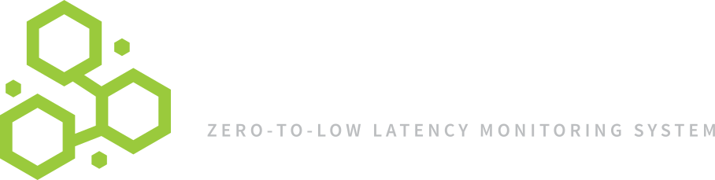
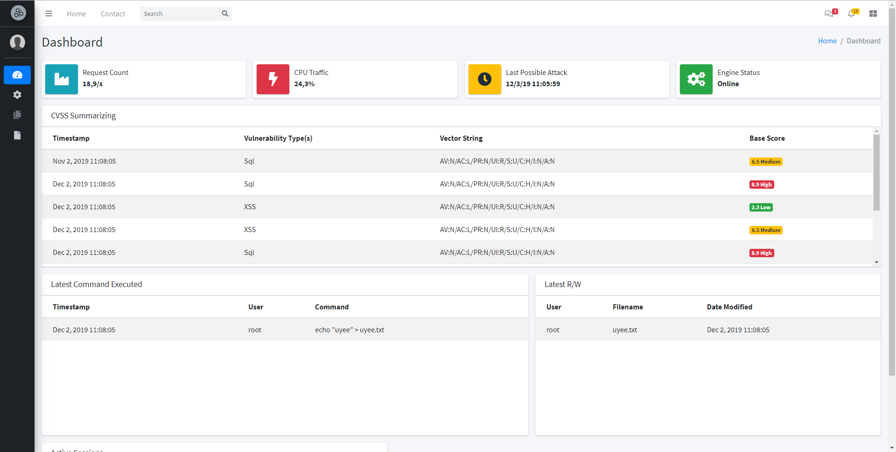

# Nethive-Project

<h1 align="center">
  <br>
  <a href="https://github.com/chrisandoryan/Nethive-Project">
  </a>
  <br>
</h1>

<h4 align="center">Zero to Low Latency Monitoring System<a href="https://github.com/chrisandoryan/Nethive-Project" target="_blank"></a></h4>

<p align="center">
  <a href="#features">Features</a> •
  <a href="#installation">Installation</a> •
  <a href="#quick-start">Quick Start</a> •
  <a href="#contributors">Contributors</a> •
  <a href="/doc/user_guide.md">User Guide</a>
</p>

**The Nethive Project** provides a Security Information and Event Management (SIEM) insfrastructure empowered by **CVSS** automatic measurements.



## Features

 - [x] Machine Learning powered SQL Injection Detection
 - [x] Server-side XSS Detection based on Chrome's XSS Auditor
 - [x] Post-exploitation Detection powered by Auditbeat
 - [x] Bash Command History Tracker
 - [x] CVSS Measurement on Detected Attacks
 - [x] Realtime Log Storing powered by Elasticsearch and Logstash
 - [x] Basic System Monitoring
 - [ ] Resourceful Dashboard UI
 - [ ] Notify Suspicious Activity via Email 

## Installation

Before installing, please make sure to install the **[pre-requisites](/doc/user_guide.md#pre-requisites)**.

You can install Nethive from PyPi package manager using the following command:

[Coming Soon!]

**or**

You can install Nethive using the latest repository:
```
$ git clone https://github.com/chrisandoryan/Nethive-Project.git
$ cd Nethive-Project/
$ sudo bash install.sh
$ sudo pip3 install -r requirements.txt
```
Please make sure all dependencies are installed if anyone of the above fails.
For more detailed information, refer to the [installation guide](/doc/user_guide.md).

## Quick Start


 1. Fetch and start **nethive-cvss** docker container
	```
	$ git clone https://github.com/Falanteris/docker-nethive-cvss/
	$ cd docker-nethive-cvss/
	$ docker build -t nethive-cvss .
	$ ./cvss
	```
 2. Start **Nethive** and copy default configuration
	```
	$ cd Nethive-Project/
	$ cp .env.example .env
	```
	
3. Activate all **Nethive** processing engines: `$ sudo python3 main.py `.  
On the menu prompt, choose **[3] Just-Run-This-Thing**, then wait for the engines to be initialized.
	
 3. Start Nethive UI Server
 	```
	$ cd Nethive-Project/dashboard/
	$ npm install && npm start
	```
		
 5. Go to http://localhost:3000/

## Contributors


